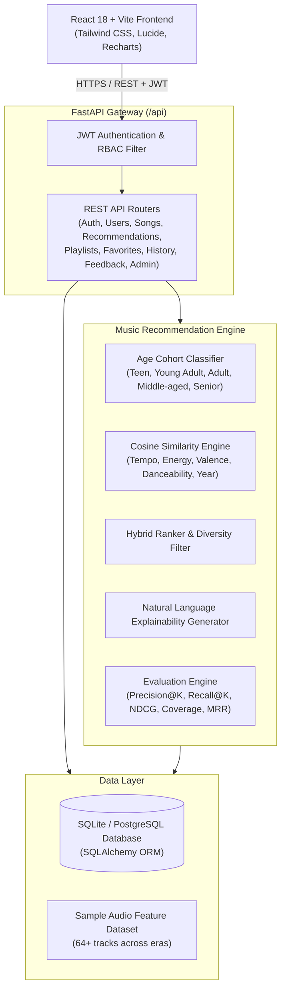
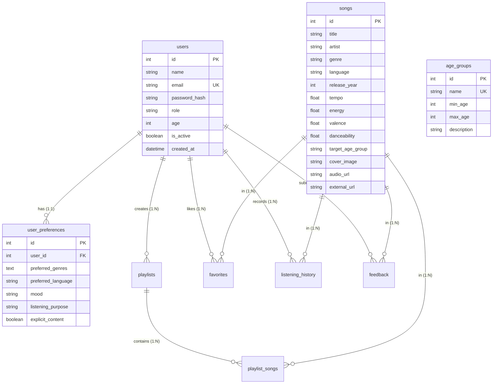

# MusicMind AI – System Architecture Documentation

## 1. Overview
**MusicMind AI** is an intelligent, full-stack, age-wise and content-based music recommendation platform designed for B.Tech Information Technology final-year project demonstration. It addresses the classical **cold-start problem** by leveraging demographic age-group priors combined with explicit user preferences and multi-dimensional audio feature cosine vector similarity.

---

## 2. High-Level Architecture Diagram

---

## 3. Entity-Relationship (ER) Diagram

---

## 4. Key Architectural Pillars

### 4.1 Cold-Start Mitigation
When a newly registered listener has zero listening history:
1. The user's age is resolved into a demographic cohort (e.g. 24 -> Young Adult).
2. The cohort's empirical prior affinities (e.g., preference for Indie, Synthwave, EDM, high danceability, release year $\ge 2010$) initialize the candidate space.
3. Explicit mood inputs and user-selected genres are combined to construct a target query feature vector.
4. Cosine similarity retrieves optimal candidate songs without requiring existing interaction history.

### 4.2 Warm-Start Hybrid Personalization
When a user accumulates interactions (favorited songs, listening history, $\ge 4$-star ratings):
1. An empirical user profile vector is computed by averaging the acoustic features of their top-rated and favorited tracks.
2. The query vector blends 60% historical profile and 40% current session context (mood and temporary filters).
3. Feedback penalties and bonuses are dynamically added to candidate scores to refine future suggestions.

### 4.3 Role-Based Access Control (RBAC)
- **Listener**: Restricted to their own profile, recommendations, playlists, history, and favorites.
- **Admin**: Has privileged access to system statistics, user deactivation/promotion, song metadata CRUD, demographic cohort boundaries, and live ML model evaluation execution.
- Security enforcement is validated strictly on the backend via dependency injection (`require_admin`).
